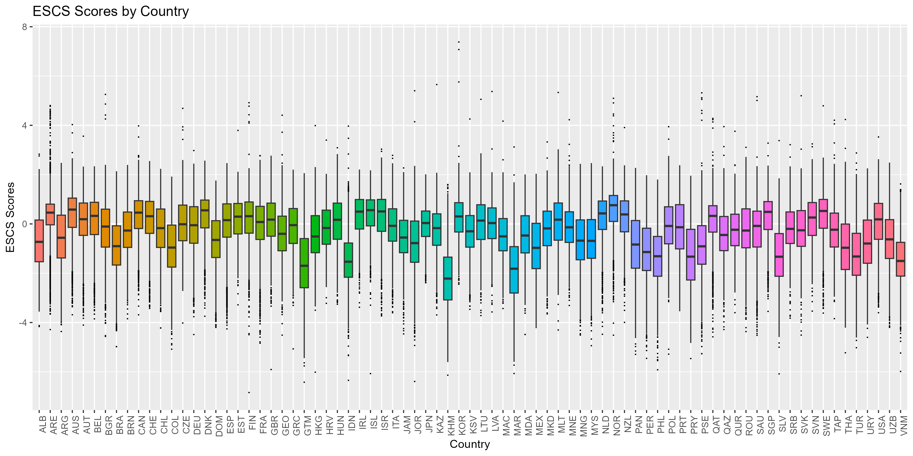
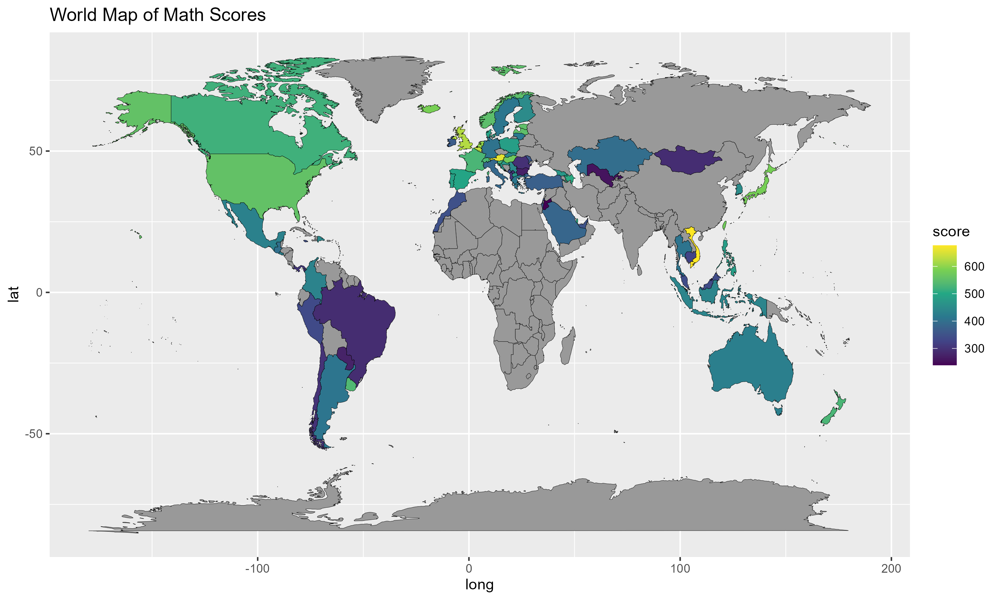
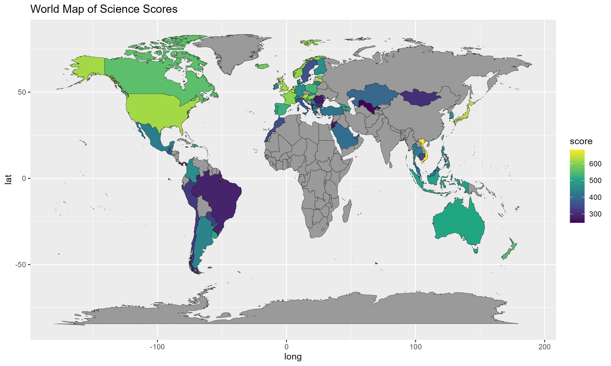

# PISA 2022 Data Visualization

Interactive and static visualizations of PISA 2022 academic performance and socioeconomic status across 79 countries using R.

## Live Demo
[View interactive visualizations on RPubs](https://rpubs.com/RumeysaGorgulu/pisa2022-visualization)

## What this covers
- ESCS (socioeconomic status) score distribution by country boxplot
- World maps of average math, reading, and science scores by country
- Interactive versions of all visualizations using Plotly

## Visualizations

| Plot | Preview |
|------|---------|
| ESCS Scores by Country |  |
| World Map Math |  |
| World Map Reading |  |
| World Map Science |  |

## Data
Requires `imputed_variables.rds` produced by:
[pisa2022-data-preparation-eda](https://github.com/RumeysaGorgulu/pisa2022-data-preparation-eda)

## Requirements
```r
install.packages(c("tidyverse", "ggplot2", "plotly", "countrycode", "htmlwidgets"))
```

## Author
Rumeysa Gorgulu
